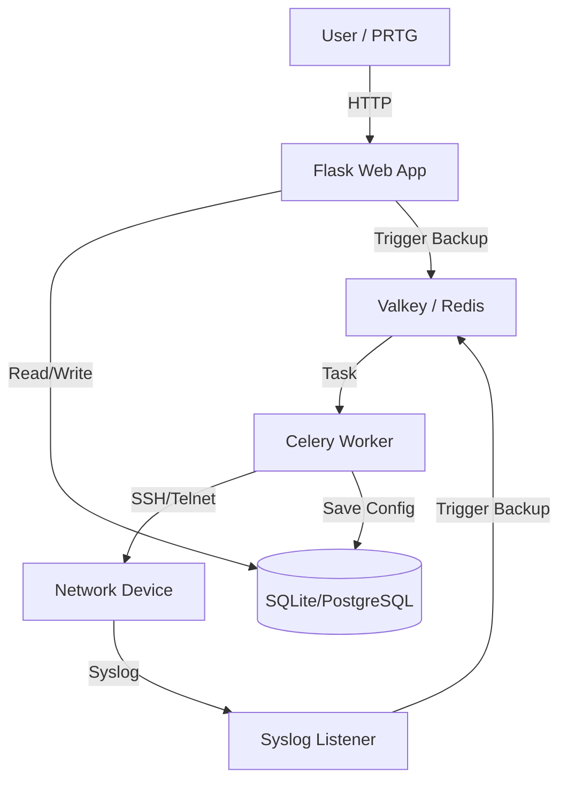

# Paessler NCM Module (MVP)

A unified Network Configuration and Change Management (NCCM) tool designed to integrate with Paessler PRTG. This module provides automated configuration backups, change detection, and compliance auditing for network devices.

## Features

- **Device Inventory**: Manage network devices with support for multiple vendors.
- **Automated Backups**: Scheduled configuration backups using Celery and Valkey.
- **Diff Engine**: Visual line-by-line comparison of configuration changes.
- **Real-Time Detection**: Syslog listener to trigger backups instantly upon config changes.
- **Multi-Vendor Support**:
    - Cisco IOS / IOS-XE
    - Huawei VRP
    - Fortinet FortiGate
    - Ubiquiti UniFi (API)
    - Ubiquiti EdgeOS (SSH)
    - (Extensible via Driver Factory)
- **Web Interface**: Clean, responsive UI with PRTG-inspired branding.

## Architecture

The application follows a modular, event-driven architecture designed for scalability and reliability.



### Core Components

1.  **Flask Web Application**: Serves the user interface and API endpoints. Handles device inventory management and displaying configuration diffs.
2.  **Celery Worker**: Executes background tasks such as connecting to network devices, fetching configurations, and calculating diffs. This ensures the web interface remains responsive.
3.  **Syslog Listener**: A standalone UDP server that listens for syslog messages (e.g., Cisco `%SYS-5-CONFIG_I`) to trigger immediate backups when changes occur.
4.  **Valkey (Redis)**: Acts as the message broker for Celery, managing the task queue between the web app/listener and the workers.
5.  **Database**: Stores device inventory, credentials (encrypted), and historical configuration backups.

## Tech Stack

### Backend
-   **Language**: Python 3.11+
-   **Framework**: Flask
-   **ORM**: SQLAlchemy
-   **Task Queue**: Celery
-   **Network Automation**: Netmiko (Multi-vendor support)
-   **Security**: Cryptography (Fernet symmetric encryption)

### Frontend
-   **Templating**: Jinja2
-   **Styling**: Vanilla CSS (PRTG-inspired design)
-   **Icons**: FontAwesome (via CDN)

### Infrastructure & Data
-   **Message Broker**: Valkey (High-performance Redis fork)
-   **Database**: SQLite (Default), compatible with PostgreSQL/MySQL


## Prerequisites

- Python 3.11+
- [Valkey](https://valkey.io/) (Redis fork)
- macOS / Linux environment

## Installation

1.  **Clone the repository**:
    ```bash
    git clone <repository-url>
    cd PRTG-NCM
    ```

2.  **Set up Virtual Environment**:
    ```bash
    python3 -m venv venv
    source venv/bin/activate
    ```

3.  **Install Dependencies**:
    ```bash
    pip install -r requirements.txt
    ```

4.  **Initialize Database**:
    ```bash
    python init_db.py
    ```

## Usage

### Starting Services

1.  **Start Valkey**:
    ```bash
    # macOS
    brew services start valkey

    # Linux (systemd)
    sudo systemctl start valkey
    ```

2.  **Start Celery Worker** (Background Tasks):
    ```bash
    celery -A celery_worker.celery worker --loglevel=info
    ```

3.  **Start Syslog Listener** (Real-time Detection):
    ```bash
    # Port 5140 is used for non-root access. Use 514 for production (requires sudo).
    python syslog_listener.py 5140
    ```

4.  **Start Web Server**:
    ```bash
    flask run --port 5001
    ```

Access the web interface at: `http://127.0.0.1:5001`

### Adding Devices

1.  Navigate to "Add Device".
2.  Enter the Hostname, IP, Vendor, and Credentials.
3.  The device will be added to the inventory.

#### Ubiquiti UniFi Controller Setup

For UniFi Controllers, you must create a **dedicated read-only administrator account** in the UniFi Controller web interface. This account is used by the NCM script to access the API without making changes to your network.

**Important parameters for UniFi:**
- **IP Address**: UniFi Controller IP or hostname (the script will connect to `https://<ip>:8443`)
- **Vendor**: `ubiquiti_unifi` or `unifi`
- **Username**: Read-only admin account username
- **Password**: Read-only admin account password
- **Enable Secret/Site ID**: (Optional) UniFi Site ID - defaults to `default` if not specified

For detailed setup instructions, see the [Ubiquiti Setup Guide](docs/ubiquiti-setup.md).

**Note**: The current UniFi driver supports Legacy UniFi Controllers. UDM/UDM-Pro (UniOS) devices may require minor API endpoint adjustments.

### Viewing Diffs

1.  Go to the Device Detail page.
2.  Click "Run Backup Now" to create a new backup.
3.  Once multiple backups exist, click "View Diff" to see changes.

## Testing

Run the automated test suite:
```bash
PYTHONPATH=. python tests/test_backup.py
PYTHONPATH=. python tests/test_syslog.py
PYTHONPATH=. python tests/test_diff_simulation.py

```

## License

This project is licensed under the Apache License 2.0 - see the [LICENSE](LICENSE) file for details.
